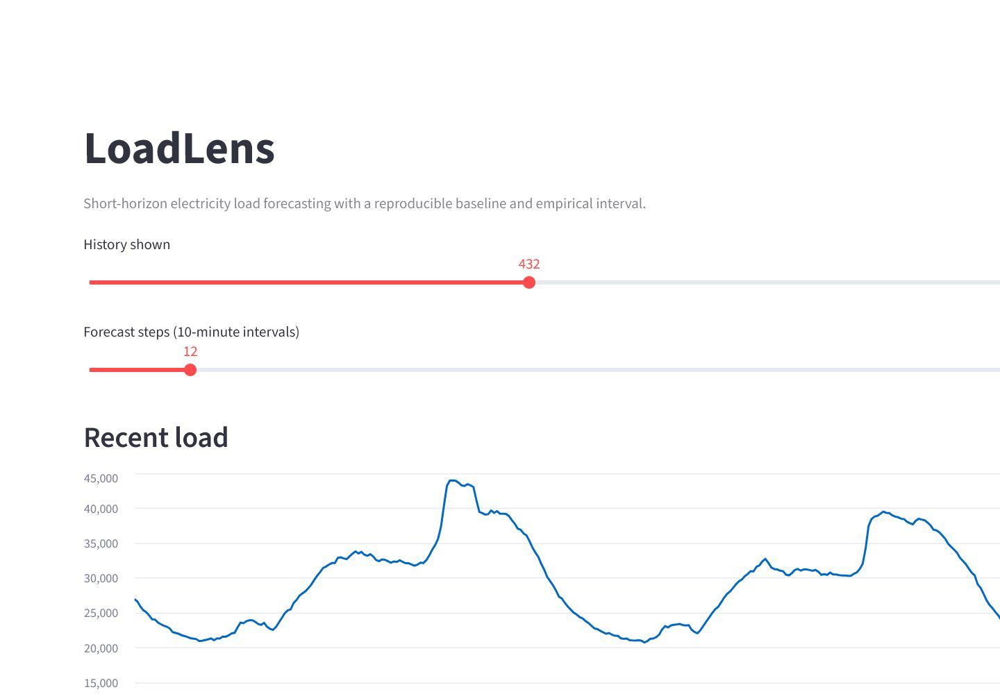
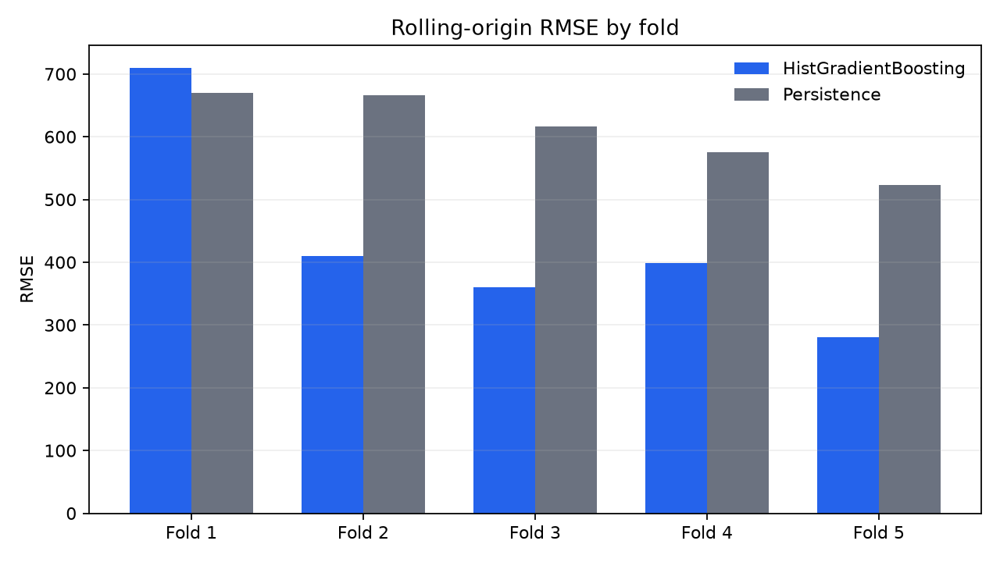

# LoadLens Forecasting Service

LoadLens is a reproducible short-horizon electricity-load forecasting service. It turns a public smart-city power-consumption dataset into a small, testable product with a FastAPI service and a Streamlit demonstration.

The project is intentionally scoped to one target zone and a one-step recursive forecast. The model is compared with a persistence baseline through expanding-window rolling-origin evaluation and served with an empirically calibrated residual band. It is not a claim of operational grid forecasting performance.

## Public demo

[Open the live Streamlit demo](https://loadlens-forecasting-service-xx64wapp6mrljcncsedvaah.streamlit.app/).

The application is stateless and may retrain on first start when no model artifact is present. The free deployment can sleep after inactivity, so the first request may take longer than subsequent requests.



## Data

The default source is the UCI `Tetouan City power consumption` dataset:

<https://archive.ics.uci.edu/dataset/849/power+consumption+of+tetouan+city>

The download script records the archive SHA-256 and writes the normalized data under `data/processed/`. Raw data and trained artifacts are ignored by Git. Tests use generated in-memory fixtures and never require network access.

## Local setup

```powershell
python -m venv .venv
.\.venv\Scripts\Activate.ps1
python -m pip install --upgrade pip
python -m pip install -r requirements-dev.txt
python scripts/download_data.py
python scripts/train.py
python -m uvicorn loadlens.api:app --reload
streamlit run app/streamlit_app.py
```

The API exposes:

- `GET /health` - process and model status;
- `GET /metrics` - holdout metrics saved with the model;
- `POST /forecast` - recursive forecasts from a short observation history.

Run tests with:

```powershell
python -m pytest
```

`requirements.txt` pins the verified production and Streamlit deployment environment. `requirements-dev.txt` adds the exact test dependencies used by CI; `pyproject.toml` retains compatibility lower bounds for package metadata.

## Evaluation design

- Five expanding-window test folds; random splits are not used.
- Features use observations available at the forecast origin: current/lagged load, calendar cycles, and observed weather fields.
- Each fold uses a pre-test calibration block for its empirical p90 residual half-width.
- Reported metrics are pooled and fold-level MAE, RMSE, persistence-baseline comparison, and empirical interval coverage.
- The interval is an empirical residual band, not an unconditional probability guarantee.

## Rolling-origin backtest (2026-07-15)

Five non-overlapping test folds cover 26,136 one-step forecasts from 2017-07-02 through 2017-12-30. Each fold re-fits the model on an expanding history.

| Metric | HistGradientBoosting | Persistence baseline |
|---|---:|---:|
| MAE | 288.62 | 411.99 |
| RMSE | 456.17 | 612.91 |

Pooled RMSE was 25.57% lower than persistence, and the model won four of five folds. Aggregate interval coverage was 89.08%. The first fold was a documented failure case: model RMSE was 5.96% worse than persistence and interval coverage fell to 76.43%, revealing regime sensitivity that a single holdout would hide.



See [the full evaluation protocol and fold table](docs/BACKTEST.md), plus the machine-readable [summary](reports/rolling_origin_summary.json) and [fold results](reports/rolling_origin_folds.csv).

## First reproducible run (2026-07-15)

Using the 52,416-row UCI snapshot from 2017-01-01 through 2017-12-30, with the last 20% held out chronologically:

| Metric | HistGradientBoosting | Persistence baseline |
|---|---:|---:|
| MAE | 249.46 | 369.43 |
| RMSE | 371.24 | 550.07 |

With interval width calibrated on an earlier block, the p90 absolute-residual half-width was 518.21 and coverage on the untouched final holdout was 89.53%. These single-holdout numbers are retained as a reproducibility check; the rolling-origin result above is the primary evaluation evidence.

## Repository layout

```text
app/                    Streamlit public demo
src/loadlens/           data, features, model, and API modules
scripts/                download and training entry points
tests/                  unit and API contract tests
reports/                versioned fold metrics, summary, and evaluation chart
data/                   ignored raw/processed data directories
artifacts/              ignored model files
```

## Limitations

The free public deployment may sleep after inactivity and has no persistent local disk. The demo therefore avoids a database and can rebuild its model from the public snapshot. Weather forecasts are not modeled; the last observed weather values are carried forward during recursive inference. Fold 1 underperformance shows sensitivity to temporal regime changes. A production system would need online monitoring, drift checks, access control, multi-horizon validation, and stronger uncertainty calibration.

## License

Code is released under the MIT license. The dataset remains subject to the UCI dataset terms; it is not redistributed in this repository.
